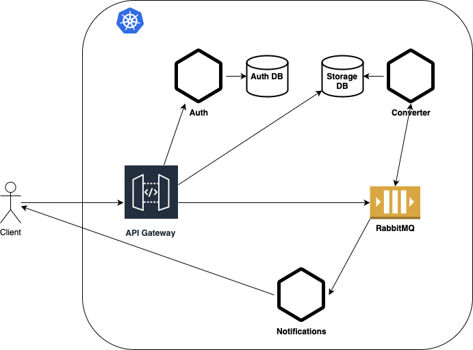

# Converter

Converts video to mp3 using async processing.

### Flow

1. Client uploads video to be converted to MP3
2. Gateway calls Auth service to verify authentication
3. Gateway stores video in Storage DB
4. Gateway puts message on RabbitMQ about new video to be processed
5. Converter service consumes message from RabbitMQ
6. Converter service converts video to MP3
7. Converter service stores MP3 in Storage DB
8. Converter service puts message on RabbitMQ about new MP3 ready
9. Notification service consumes message from RabbitMQ
10. Notification service sends notification to Client about MP3 ready
11. Client requests to Download MP3
12. Gateway pulls MP3 and serves it to the Client